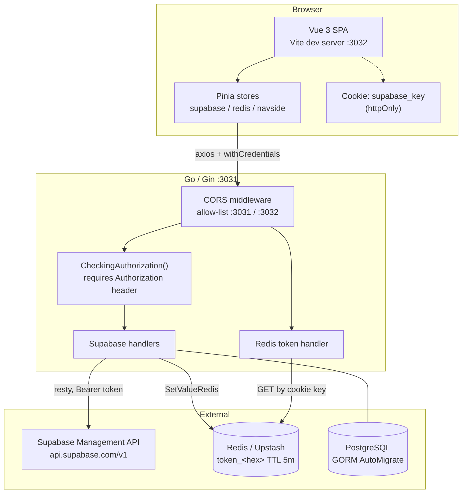
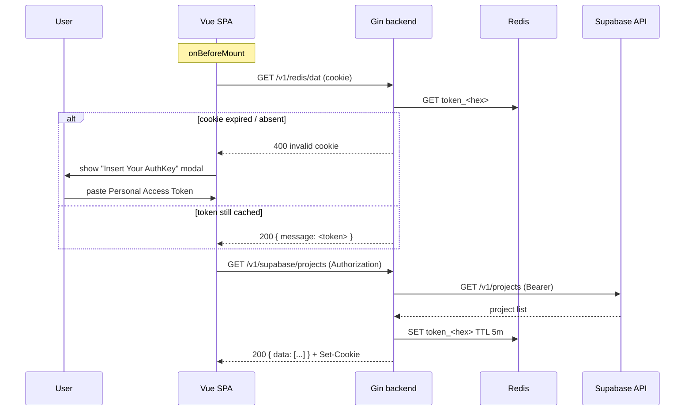

# Pulsr

> Stop tab-hopping. Just check.

**Pulsr** ("pulse" + "r") is a self-hosted monitoring dashboard that pulls the health and
usage of your hosted services into one place, so you don't need a browser tab per provider
console.

The repo is a two-part monorepo: a **Go / Gin** backend acting as an authenticated proxy
over provider management APIs, and a **Vue 3 + TypeScript** frontend rendering the
dashboard.

> **Status: early work in progress.** Only the **Supabase** integration is implemented.
> Several packages (`checker/`, `scheduler/`, `service/`, `repository/`) exist as empty
> placeholder files, and the Docker/Compose files are non-functional stubs. This README
> documents what is in the code today and marks placeholders explicitly.

[Features](#features) · [Architecture](#architecture) · [Requirements](#requirements) ·
[Installation](#installation) · [Configuration](#configuration) · [Running](#running) ·
[API](#api-overview) · [Data stores](#data-stores) · [Security](#security-notes) ·
[Development](#development) · [Testing](#testing) · [Deployment](#deployment) ·
[Troubleshooting](#troubleshooting) · [Contributing](#contributing)

---

## How it works

Every hosting provider ships its own dashboard, so answering "is everything up?" means
logging into several consoles. Pulsr targets that context-switching cost with one page that
talks to each provider's management API using credentials you supply.

Today, end to end:

1. You paste a **Supabase Personal Access Token** into the frontend.
2. The frontend sends it as an `Authorization` header to the Go backend.
3. The backend forwards the request to the **Supabase Management API** using
   [resty](https://github.com/go-resty/resty), deserialises into typed Go structs, and
   returns normalised JSON.
4. On a successful project listing the backend caches the token in **Redis** under a random
   key with a **5-minute TTL**, and returns the *key name* in an `httpOnly` cookie
   (`supabase_key`). The raw token never touches `localStorage`.
5. Later page loads call `GET /v1/redis/dat`, which resolves cookie → Redis → token, so a
   refresh inside the TTL window does not re-prompt.

Long-lived provider credentials are never persisted to disk. The token lives in Redis only,
for five minutes.

---

## Features

Only the items below are backed by working code.

| Feature | What it does |
| --- | --- |
| Supabase organizations | List organizations, and per-org detail (`plan`, `opt_in_tags`, `allowed_release_channels`). |
| Supabase projects | List all projects (region, status, embedded Postgres `database` block), plus single-project detail by ref. |
| API usage analytics | Proxies `analytics/endpoints/usage.api-counts` — auth / realtime / REST / storage request counts. |
| Request logs | Proxies `analytics/endpoints/logs.all`, auto-windowed to the **last hour** (timestamps computed server-side). |
| Pause / resume a project | `POST` to Supabase `projects/{ref}/pause` and `projects/{ref}/restore`. |
| Redis-backed token session | Random 10-byte hex key, stored as `token_<hex>` with a 5-minute TTL, key delivered as an `httpOnly` `SameSite=Lax` cookie. |
| Token read-back | `GET /v1/redis/dat` resolves cookie → Redis → token so the SPA can rehydrate. |
| Bearer-token gate | Middleware rejects any request without an `Authorization` header (401). |
| CORS allow-list | Only `http://localhost:3031` and `http://localhost:3032`; credentials allowed, `OPTIONS` short-circuits with 204. |
| Auto-migration | GORM `AutoMigrate` for the single `AccsesTokenSupabase` table on boot. |
| SPA dashboard | Sidebar panel switcher, token prompt modal, project cards, PrimeVue skeleton loading states. |
| Client-side routing | `/` (dashboard) and `/supabase/project/:id` (project detail). |

### Not implemented

These exist as **empty files or directories** despite their suggestive names:

- `internal/checker/*` (Cloudflare, Docker, Domain SSL, Groq, Koyeb, MongoDB, Redis, web),
  `internal/scheduler/`, `internal/service/`, `internal/repository/`, `internal/config/`,
  `internal/handler/auth_handler.go`, `internal/handler/health_handler.go`,
  `internal/model/monitor.go`, `pkg/utils/`.
- **No scheduler/cron, no notifications, no uptime history, no WebSocket, no multi-user
  auth, no charting.** `chart.js` is in `package.json` but never imported.
- The sidebar lists nine providers; only **Supabase** has a backing panel. `Vercel.vue` is
  an empty template.
- `GET /v1/supabase/edge/status` is registered with **no handler** and returns an empty 200.

---

## Architecture

Pulsr is a **thin authenticated proxy** in front of provider APIs. The backend holds no
business state of its own: Postgres exists only for the table created by `AutoMigrate`, and
Redis holds short-lived tokens.



### Session flow — first visit vs. refresh



### Where things live

| Path | Responsibility |
| --- | --- |
| `backend/cmd/server/main.go` | Entrypoint: loads `.env`, builds Gin, installs CORS, connects Postgres + Redis, runs `AutoMigrate`, registers routes, listens on `:3031`. |
| `backend/internal/routing/` | Single `SetupRouting(db, engine, rdb)`; all routes declared inline. |
| `backend/internal/handler/` | `monitor_handler.go` — closure-style `gin.HandlerFunc` factories, one per Supabase endpoint. Other files are empty. |
| `backend/internal/midlewere/` | `Authorization`-header presence check. Note the in-repo spelling. |
| `backend/internal/struct/` | Supabase response DTOs. |
| `backend/internal/cache/`, `internal/database/` | Redis singleton (`sync.Once`, 5s ping check), token session helpers, and the GORM Postgres connection. |
| `backend/internal/{checker,scheduler,service,repository,config}/`, `pkg/utils/` | ⚠ empty placeholders. |
| `frontend/src/main.ts`, `App.vue` | Vue Router + PrimeVue (Aura) + Pinia bootstrap. |
| `frontend/src/store/` | Pinia setup-stores: `redis`, `project` / `detailOrgs` / `projectdetail`, `shared`. |
| `frontend/src/Monitoring/`, `Supabase/`, `view/`, `components/` | `Supabase.vue` and the project detail page are implemented; `Vercel.vue`, `ErrorPage.vue`, `ui/Dialog.vue`, and three static Supabase cards are unused. |

---

## Requirements

| Requirement | Version | Notes |
| --- | --- | --- |
| Go | **1.26.2** | Per `backend/go.mod`. |
| Node.js | **22.x** | Verified on v22.21.1. |
| pnpm | **10.x** | `pnpm-lock.yaml` is the lockfile of record; npm works but ignores it. |
| PostgreSQL | Any version GORM's pgx driver supports | Used only for `AutoMigrate`; no migration files in-repo. |
| Redis | Any instance reachable via a `redis://` / `rediss://` URL | **Required at boot** — the process exits if it can't connect. |
| Supabase Personal Access Token | — | Runtime input, created at `supabase.com/dashboard/account/tokens`. |
| Air | optional | Live reload for the Go server (`backend/.air.toml`). |

Docker is **not** a viable path today — see [Deployment](#deployment).

---

## Installation

### 1. Clone

```bash
git clone <repository-url> pulsr
cd pulsr
```

### 2. Provision datastores

A reachable PostgreSQL instance and a Redis instance are both required before the backend
will start. Any managed provider works; the env var name assumes Upstash for Redis.

### 3. Backend

```bash
cd backend
go mod download
```

The repo does not ship a `.env.example`. Create `backend/.env` using
[Configuration](#configuration) as the reference:

```bash
# backend/.env
DB_HOST=localhost
DB_PORT=5432
DB_USER=postgres
DB_PASSWORD=<your-password>
DB_NAME=pulsr
DB_SSLMODE=disable

UPSTASH_REDIS_URL=redis://default:<password>@<host>:<port>
SUPABASE_URL=https://api.supabase.com/v1/
```

Confirm it compiles:

```bash
go build ./...
```

### 4. Frontend

```bash
cd ../frontend
pnpm install
```

### 5. Get a Supabase Personal Access Token

1. Open <https://supabase.com/dashboard/account/tokens>.
2. **Generate new token** and name it.
3. Copy it immediately — Supabase shows it once.

You paste this into the UI at runtime; it is never written to a config file.

---

## Configuration

### Backend environment variables

Loaded by `godotenv.Load()` from `backend/.env`, falling back to the process environment.
There is no validation layer — a missing variable surfaces as a connection error at boot,
not a clear message.

| Variable | Required | Purpose |
| --- | --- | --- |
| `DB_HOST` | ✅ | Postgres hostname. |
| `DB_PORT` | ✅ | Postgres port. |
| `DB_USER` | ✅ | Postgres user. |
| `DB_PASSWORD` | ✅ | Postgres password. |
| `DB_NAME` | ✅ | Database name. |
| `DB_SSLMODE` | ✅ | libpq sslmode — `disable`, `require`, `verify-full`, … |
| `UPSTASH_REDIS_URL` | ✅ | Full Redis URL, parsed by `redis.ParseURL`. A bad URL or failed ping calls `log.Fatalf` and the process exits. |
| `SUPABASE_URL` | ✅ | Base URL of the Supabase Management API. Handlers concatenate paths directly onto it, so it **must end with a trailing slash**: `https://api.supabase.com/v1/`. |
| `GIN_MODE` | — | Set to `release` outside development; Gin defaults to debug mode. |

> **Never commit `backend/.env`.** It is covered by `backend/.gitignore`, and no real
> credential values appear anywhere in this README.

`HandlerOrg`, `HandlerOrgDetail`, and `HandlerSupabaseAnalyticsLogs` hardcode
`https://api.supabase.com/v1/...` rather than reading `SUPABASE_URL`. Worth normalising,
but it means those three endpoints work even when `SUPABASE_URL` is unset.

### Frontend configuration

The frontend has **no** `.env` and reads no `import.meta.env` variables. Everything is
hardcoded:

| Setting | Value | Location |
| --- | --- | --- |
| Dev server port | `3032` | `vite.config.ts` |
| Backend base URL | `http://localhost:3031` | `store/supabase.ts`, `store/redis.ts` (per call) |
| PrimeVue theme | Aura preset, `darkModeSelector: ".app-light"` | `main.ts` |
| Router history | HTML5 (`createWebHistory`) | `routing/index.ts` |

If you change either port you must also update the CORS allow-list in
`backend/cmd/server/main.go` and the hardcoded axios URLs. The allow-list is exact-match on
scheme + host + port, so `127.0.0.1:3032` is a *different* origin from `localhost:3032`.

---

## Running

Two processes, two terminals. Start the backend first — the frontend calls it on mount.

```bash
# Backend → http://localhost:3031
cd backend
go run ./cmd/server/main.go
# or, with live reload:
air

# Frontend → http://localhost:3032
cd frontend
pnpm dev
```

Expected backend boot output: `Succses connect to redis`, the `[GIN-debug]` route listing,
then `Listening and serving HTTP on :3031`. Air builds to `tmp/main` and logs compile
failures to `tmp/build-errors.log` while keeping the old binary running.

Frontend build and a manual backend binary:

```bash
cd frontend
pnpm build      # vue-tsc -b && vite build  →  dist/
pnpm preview    # serve the built dist/ locally

cd ../backend
go build -o ./tmp/pulsr ./cmd/server/main.go && ./tmp/pulsr
```

`pnpm build` type-checks first, so a type error fails the build. There is one known
pre-existing error on `main` — see [Testing](#testing). The backend listen port is
hardcoded to `3031` in `main.go` and is not env-driven.

---

## API overview

Base URL in development: **`http://localhost:3031`**

| Method | Path | Auth | Purpose |
| --- | --- | --- | --- |
| `GET` | `/ping` | none | Liveness. |
| `GET` | `/v1/supabase/projects` | Bearer | List projects **and establish the Redis session** (sets the `supabase_key` cookie). |
| `GET` | `/v1/supabase/org` | Bearer | List organizations. |
| `GET` | `/v1/supabase/org/:id` | Bearer | Organization detail. |
| `GET` | `/v1/supabase/projects/:id` | Bearer | Single project by ref. |
| `GET` | `/v1/supabase/analytics/usage/:id` | Bearer | API request counts (returned under `message`, not `data`). |
| `GET` | `/v1/supabase/analytics/logs/:id` | Bearer | Request logs for the last hour; no query params are read from the caller. |
| `POST` | `/v1/supabase/project/pause/:id` | Bearer | Pause a project. ⚠ takes its database and APIs offline until resumed. |
| `POST` | `/v1/supabase/project/start/:id` | Bearer | Resume a paused project. |
| `GET` | `/v1/redis/dat` | cookie | Resolve `supabase_key` → cached token. |
| `GET` | `/v1/supabase/edge/status` | none | ⚠ no handler registered; returns an empty 200. |

Successful Supabase responses are shaped `{ "status": 200, "data": … }`, except the
analytics endpoints, which use `message` / `result`. Errors are `{ "message": … }` with the
upstream status mapped through — 401 for a rejected token, 400 for a transport failure.

### Authentication model

`midlewere.CheckingAuthorization()` only checks that the `Authorization` header is
**non-empty**. Real validation is delegated to Supabase: the handler forwards the value via
resty's `SetAuthToken`, which emits `Authorization: Bearer <value>`, and maps an upstream
401 back to the caller.

Because resty adds the `Bearer ` prefix, send the **raw token**:

```http
Authorization: <your-supabase-personal-access-token>
```

### Example

```bash
# Establish the session and save the cookie
curl -i -c cookies.txt \
  -H "Authorization: $SUPABASE_PAT" \
  http://localhost:3031/v1/supabase/projects

# Rehydrate the token from Redis using that cookie
curl -b cookies.txt http://localhost:3031/v1/redis/dat
```

---

## Data stores

### PostgreSQL (GORM)

Connected via `gorm.io/driver/postgres` (pgx v5) with `PreferSimpleProtocol: true`, which
disables prepared-statement caching — what poolers like PgBouncer in transaction mode
require.

Exactly one model, auto-migrated on every boot:

```go
// internal/model/user.go
type AccsesTokenSupabase struct {
    gorm.Model                 // ID, CreatedAt, UpdatedAt, DeletedAt (soft delete)
    Authorization string `validate:"required"`
}
```

No relationships, no migration tool, no SQL files, no seeds. To add a model, define it in
`internal/model/` and register it in the `AutoMigrate` call in `main.go`.

> The table is currently never read from or written to — no handler touches it. Postgres is
> still a hard boot dependency because `AutoMigrate` runs unconditionally. The
> `validate:"required"` tag is inert; no validator is wired in.

### Redis

| Aspect | Detail |
| --- | --- |
| Client | `github.com/redis/go-redis/v9` |
| Init | `cache.GetClient()` — `sync.Once` singleton, `redis.ParseURL`, 5s ping timeout, `log.Fatalf` on failure |
| Key | `token_<20 hex chars>` from `crypto/rand` (10 random bytes) |
| Value | the raw Supabase personal access token |
| TTL | **5 minutes**, matching the cookie's `Max-Age=300` |

No other keys, no pub/sub, no other data structures.

---

## Security notes

Pulsr has **no user accounts** — no login, registration, password hashing, JWT issuance,
roles, or permissions. Authentication is entirely credential pass-through: your Supabase
Personal Access Token *is* the credential, and Supabase performs the authorization.

Read these before exposing the service anywhere. They are properties of the current code:

- **The cookie is set with `Secure=false`.** Fine on `localhost`; over plain HTTP elsewhere
  the cookie travels in cleartext. Set it to `true` behind TLS.
- **`/v1/redis/dat` is authenticated by the cookie alone** and returns the raw Supabase
  token in a JSON body. The key carries 80 bits of entropy so guessing is impractical, but
  there is no CSRF token and no origin check beyond CORS — and CORS prevents a response
  from being *read* cross-origin, not a request from being *sent*.
- **Gin trusts all proxies** by default and warns at startup. Call
  `engine.SetTrustedProxies(...)` before exposing the service.
- **Debug mode** leaks the route table and verbose logging. Set `GIN_MODE=release`.
- **No rate limiting** anywhere.
- **Your Supabase token is account-scoped**, not project-scoped: it can read every
  organization and project on the account, and the pause/restore endpoints can take
  projects offline. Prefer a dedicated token you can revoke.

---

## Development

### Patterns to match

**Handler factories.** Every handler is a function *returning* a `gin.HandlerFunc`, so
dependencies are captured by closure rather than package globals:

```go
func HandlerSupabaseGetAllProject(db *gorm.DB, rdb *redis.Client) gin.HandlerFunc {
    return func(ctx *gin.Context) { /* ... */ }
}
```

Each handler then follows the same shape: read the `Authorization` header, build a resty
request with `SetAuthToken` + `SetResult(&typed)`, call Supabase, branch on `err` and
`res.StatusCode()`, emit `ctx.JSON`.

**Pinia setup stores.** All frontend stores use the function form and return an explicit
object of refs and actions; consumers use `storeToRefs()` to preserve reactivity when
destructuring.

**Panel switching.** `Dashboard.vue` renders all monitoring panels and toggles visibility
with a class bound to the `shared` store, rather than routing between them.

### Conventions

- The package name `midlewere` and files like `auth_middlewere.go` / `*_cheker.go` carry
  in-repo misspellings. Renaming is reasonable cleanup, but do it as a dedicated commit —
  it touches every import site.
- Package `Struct` (capitalised) in `internal/struct/`, referenced as `Struct.Project`.
- The Go module is named `pulsr`, so internal imports are `pulsr/internal/...`.
- Vue SFCs use `<script setup lang="ts">` with inline Tailwind utility classes.
- Commit messages follow [Conventional Commits](https://www.conventionalcommits.org/).

### Where to add things

| Goal | Steps |
| --- | --- |
| New Supabase endpoint | Add the DTO to `internal/struct/projectStruct.go` → add a handler factory to `monitor_handler.go` → register it in `router.go` with `midlewere.CheckingAuthorization()`. |
| New provider | Create `internal/handler/<provider>_handler.go` following the resty pattern, add a `<PROVIDER>_URL` env var, register routes under `v1/<provider>/`. The commented section headers in `router.go` mark the intended slots. |
| Health checkers | The empty `internal/checker/*.go` files are the intended home, driven by a scheduler. |
| Scheduled polling | `internal/scheduler/scheduler.go` is empty and `robfig/cron/v3` is already in `go.mod`. |
| Uptime history | Add a model in `internal/model/`, register it in `AutoMigrate`, add a repository in `internal/repository/`. |
| Centralised config | `internal/config/config.go` is empty; a typed, validated config struct would remove the silent-misconfiguration failure modes. |
| New frontend panel | Create `src/Monitoring/<Name>.vue` → add a `<section>` in `Dashboard.vue` → add its entry to the `monitoring` array in `Sidebar.vue`. |
| New API call | Add an action to the relevant store in `src/store/`; keep `withCredentials: true` on anything depending on the `supabase_key` cookie. |

### Good first issues

Verified, concrete problems if you're looking for a place to start:

1. Fix `organizationId` → `organization_id` in `Supabase.vue:67` — this unblocks `pnpm build`.
2. Fix `store/supabase.ts:72-83`: it reads a `localStorage` key nothing ever writes and
   sends it with a misspelled `Barer` scheme, so project analytics always 401. Source the
   token from the `Redis` store like the other actions do.
3. Add missing `return`s after the error responses in `HandlerSupabaseAnalytics` and
   `GetValueRedis`, which currently double-write response bodies.
4. Replace the hardcoded org card in `Supabase.vue` and the hardcoded stat tiles in
   `SupabaseProject.vue` with `v-for` over the fetched data.
5. Remove debug leftovers (the `"dasdasdasdsad"` strings in `router.go` and
   `monitor_handler.go`, stray `fmt.Println(res)` calls).
6. Give `/v1/supabase/edge/status` a handler, or delete the route.
7. Make the server port and the frontend's API base URL configurable.

---

## Testing

**There are no test files in this repository** — no `*_test.go`, no frontend test runner, no
test script, and no CI configuration. No linter is configured either (no ESLint, Prettier,
or golangci-lint config), though `tsconfig.app.json` enables compiler-level linting.

What you can run today:

| Task | Command |
| --- | --- |
| Backend compile check | `cd backend && go build ./...` |
| Backend static analysis | `cd backend && go vet ./...` |
| Backend format check | `cd backend && gofmt -l .` |
| Frontend type check | `cd frontend && npx vue-tsc -b` |
| Frontend build (type check + bundle) | `cd frontend && pnpm build` |

### Known type-check failure

```text
src/Monitoring/Supabase.vue(67,50): error TS2551:
  Property 'organizationId' does not exist on type 'Project'.
  Did you mean 'organization_id'?
```

`Supabase.vue:40` correctly uses `org.organization_id`; the duplicate logic in
`submitAuthKey` at line 67 does not. `pnpm build` fails until this is reconciled;
`pnpm dev` still works because Vite does not type-check.

For new tests: Go uses `*_test.go` beside the code with `go test ./...`; Vitest is the
conventional Vite pairing for the frontend, though nothing is installed yet.

---

## Deployment

**There is no working deployment configuration in this repository.** Three files gesture at
containerisation and all three are stubs:

| File | Contents | Status |
| --- | --- | --- |
| `docker-compose.yml` | `services` and nothing else | Invalid — no services defined. |
| `backend/dockerfile` | `FROM go1.26.2` | Not a valid image reference. |
| `frontend/dockerfile` | `FROM node22.21.1` | Same problem. |

There is also no CI config, no Kubernetes manifests, and no platform config. Rather than
invent a deployment story, here is what the code tells you it needs:

- **Backend:** a Go binary, the env vars from [Configuration](#configuration), reachable
  Postgres + Redis, and **port 3031** — hardcoded, so make it configurable before deploying
  anywhere that assigns a port.
- **Frontend:** `pnpm build` produces a static `dist/` any host can serve. The backend URL
  is hardcoded to `http://localhost:3031` in the stores, so parameterise it (e.g.
  `import.meta.env.VITE_API_URL`) first.
- **Before exposing publicly:** set `GIN_MODE=release`, set the cookie's `Secure` flag,
  call `SetTrustedProxies`, widen the CORS allow-list to your real origin, and read
  [Security notes](#security-notes).

---

## Troubleshooting

| Symptom | Cause and fix |
| --- | --- |
| `invalid redis url` / `invalid connect to redis`, process exits at boot | `cache.GetClient()` calls `log.Fatalf` on a parse failure or failed ping. `UPSTASH_REDIS_URL` needs a scheme (`redis://…`, `rediss://…`); a bare `host:port` will not parse. The ping timeout is 5s, which a cold or distant instance can trip. |
| Nothing from `.env` is loaded | `godotenv.Load()` resolves relative to the **working directory**. Run from `backend/`, not the repo root. |
| Nil-pointer panic at startup right after a Postgres error line | `main.go` prints the Postgres error but continues, then calls `AutoMigrate` on a nil `*gorm.DB`. The printed error above the panic is the real cause — check the `DB_*` values and that `DB_SSLMODE` matches what the server requires (managed Postgres usually needs `require`). |
| `401 {"error":"needed authorization token"}` | No `Authorization` header reached the middleware. Send the raw token; resty adds `Bearer ` itself. In the browser this means the token state never populated — check `GET /v1/redis/dat` in the network tab. |
| `401 {"message":"invalid authorization token"}` on `/v1/supabase/projects` | Supabase rejected the token. Regenerate it at <https://supabase.com/dashboard/account/tokens>. |
| The token modal reappears every few minutes | Expected: the Redis TTL and cookie `Max-Age` are both 5 minutes, hardcoded in `Redis_handler.go` and `monitor_handler.go`. Raise them together. |
| CORS errors in the console | Only `http://localhost:3031` and `http://localhost:3032` are allowed. Add your origin to `allowedOrigins` in `backend/cmd/server/main.go`; matching is exact on scheme + host + port. |
| Cookie not sent / `invalid cookie` from `/v1/redis/dat` | The axios call needs `withCredentials: true` (present in `store/redis.ts` and `allproject`, but **not** in `detailOrg` or `allprojectData`). With curl use `-c` to save and `-b` to send. The cookie is `Secure=false`, so a browser that upgraded the request to `https://` will not send it. |
| Project analytics always empty on `/supabase/project/:id` | Known bug — see [Good first issues](#good-first-issues) #2. |
| `pnpm build` fails with TS2551 | Pre-existing error documented in [Testing](#testing). |
| `docker compose up` fails | The Compose file and both dockerfiles are stubs. Run the two processes directly. |
| Slow-SQL warnings in the log | GORM logs `SLOW SQL >= 200ms` for `AutoMigrate` DDL introspection against a remote database on first boot. Harmless; it only runs at startup. |

---

## Contributing

Contributions are welcome — the project has plenty of clearly-marked empty slots.

1. Follow [Installation](#installation), then confirm your environment:
   ```bash
   cd backend && go build ./...
   cd ../frontend && pnpm install
   ```
2. Branch from `main` (`git switch -c feat/vercel-checker`) and keep backend and frontend
   changes in separate commits where practical.
3. Follow the existing [conventions](#conventions), including the in-repo package names
   (`midlewere`, `Struct`) unless you're deliberately doing a rename commit.
4. Verify before pushing:
   ```bash
   cd backend && go build ./... && go vet ./... && gofmt -l .
   cd ../frontend && npx vue-tsc -b
   ```
   `vue-tsc` reports one pre-existing error (`Supabase.vue:67`) — make sure you haven't
   added a second.
5. Use Conventional Commits (`feat:`, `fix:`), matching the existing history.
6. Open a pull request describing what changed, how you tested it, and anything you left
   out.

Guidelines:

- **Never commit `backend/.env`** or any real token. It's gitignored — keep it that way.
- Don't add a dependency without a direct import; `go.mod` already carries several unused
  requirements (`robfig/cron/v3`, `golang-jwt/jwt/v5`, `mongo-driver`, `validator`, `uuid`,
  `quic-go`, `go-yaml`) left over from the original plan.
- New env vars belong in the [Configuration](#configuration) table.
- Tests are welcome — there are none yet, so you'd be establishing the pattern.

---

## License

MIT — see [`LICENSE`](LICENSE). Copyright (c) 2026 MipanZuzu.

> `backend/readme.md` and `frontend/README.md` are stale: the former lists aspirational
> features and an outdated file tree, the latter is the untouched Vite scaffold. This root
> README is the accurate one.
